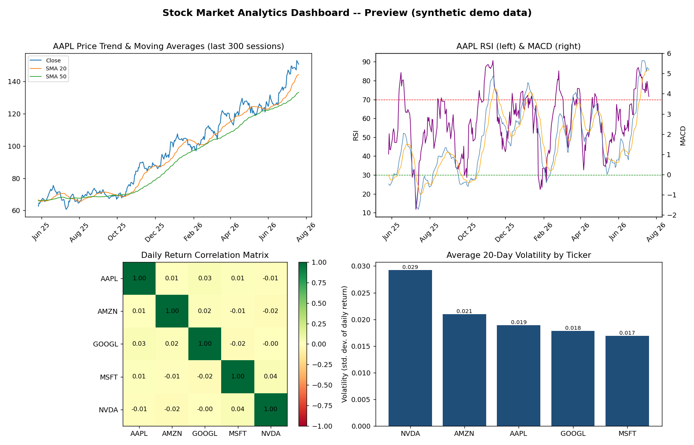

# Stock Market Analytics Pipeline

An end-to-end data engineering project: a Python ETL pipeline that pulls
historical stock data, cleans it, computes technical indicators, loads it
into a PostgreSQL star-schema warehouse, and surfaces it through a SQL
analytics layer and a Power BI dashboard.

**Tickers:** AAPL · MSFT · GOOGL · AMZN · NVDA



## Architecture

```
Yahoo Finance (yfinance)
        │
        ▼
   etl/extract.py  ──►  data/raw/*.csv
        │
        ▼
   etl/clean.py    ──►  data/processed/*_clean.csv   (+ validation report)
        │
        ▼
   etl/features.py ──►  data/processed/*_features.csv, all_tickers_features.csv
        │
        ▼
   etl/load.py      ──►  PostgreSQL (dim_ticker, dim_date, fact_prices, fact_indicators)
        │
        ▼
   sql/views.sql, sql/analytics_queries.sql  ──►  Power BI dashboard
```

Everything is chained by `run_pipeline.py` and is idempotent — re-running
the pipeline upserts rather than duplicates rows.

## Tech stack

Python 3.11 · pandas/numpy · yfinance · PostgreSQL · SQLAlchemy · SQL
(window functions, CTEs, materialized views) · pytest · Power BI · Git/GitHub

## Repository layout

```
etl/                  Extract / clean / feature / load modules
sql/                  schema.sql, views.sql, analytics_queries.sql
tests/                pytest unit tests for cleaning + feature logic
data/raw/             Raw pulls (gitignored, populated at runtime)
data/processed/       Cleaned + feature-enriched CSVs (gitignored)
dashboard/            Power BI setup guide + exported CSV + preview image
docs/                 Data dictionary
run_pipeline.py        Orchestrator: extract → clean → features → load
config.yaml            Tickers, date range, indicator params, DB target
```

## Setup

```bash
python -m venv venv
source venv/bin/activate          # Windows: venv\Scripts\activate
pip install -r requirements.txt
cp .env.example .env               # fill in DATABASE_URL if using PostgreSQL
```

### Database

By default `config.yaml` targets a local **SQLite** file (`stock_analytics.db`)
so the whole pipeline runs with zero external setup. To use real **PostgreSQL**:

1. Create a database: `createdb stock_analytics`
2. Apply the schema: `psql stock_analytics -f sql/schema.sql`
3. Set `database.target: "postgresql"` in `config.yaml`
4. Set `DATABASE_URL` in `.env`

## Running the pipeline

```bash
python run_pipeline.py             # live data via yfinance (needs internet)
python run_pipeline.py --demo      # synthetic offline data, for dev/testing
```

Each step can also be run individually: `python -m etl.extract`,
`python -m etl.clean`, `python -m etl.features`, `python -m etl.load`.

## Testing

```bash
pytest --cov=etl tests/
```

Unit tests cover the cleaning logic (deduping, missing-data handling, schema
validation) and the feature calculations (SMA/RSI/MACD/Bollinger Bands
checked against known reference values), plus an integration-style check
that row counts reconcile between processed files and the database.

## SQL analytics layer

`sql/views.sql` and `sql/analytics_queries.sql` include: rolling moving
averages via window functions, 52-week high/low, month-over-month and
year-over-year performance via CTEs, a pairwise return-correlation matrix,
volatility ranking, top single-day gainers/losers, and a materialized view
(`mv_daily_summary`) that keeps the dashboard's KPI page fast.

## Power BI dashboard

See `dashboard/POWERBI_SETUP.md` for connection steps and DAX measures.
Four report pages: Price Trends & Moving Averages, Technical Indicators
(RSI/MACD), Comparative Performance & Correlation Heatmap, and a Summary
KPI page.

## Notes on this build

This repository was scaffolded and implemented with AI assistance (Claude)
in an offline sandbox, which is why `data/raw/`, `stock_analytics.db`, and
the dashboard preview were generated from `etl/demo_data.py` (a seeded
synthetic random-walk generator), not live Yahoo Finance data — there was
no internet access available to actually call the API. `etl/extract.py`
is the real, unmodified implementation meant to run against live data; it
was validated for correctness (retry/backoff logic, schema shape) but not
executed end-to-end against the live API in this environment. Swap to it
by dropping `--demo` from the `run_pipeline.py` command once you're running
this with normal internet access. The SQLAlchemy-based `etl/load.py` and
`etl/db.py` are the real deliverable for both SQLite and PostgreSQL;
`etl/demo_load_sqlite.py` is a stdlib-only stand-in used only because this
sandbox couldn't `pip install` SQLAlchemy/psycopg2.

## Possible future improvements

- Add more tickers / a benchmark index (e.g. SPY) for relative-performance comparisons
- Airflow-based scheduling instead of cron/APScheduler
- Sentiment features from news/earnings-call text
- Dockerized one-command setup

## Resume bullet points

- Built an end-to-end Python ETL pipeline extracting, validating, and
  enriching 5+ years of daily OHLCV data across 5 tickers with 12 technical
  indicators (SMA, EMA, RSI, MACD, Bollinger Bands, rolling volatility)
- Designed a normalized star-schema PostgreSQL warehouse (2 dimension +
  2 fact tables) with idempotent upsert loading and automated data-quality checks
- Wrote a SQL analytics layer using window functions, CTEs, and materialized
  views to compute rolling stats, cross-ticker correlation, and volatility rankings
- Built a 4-page interactive Power BI dashboard with custom DAX measures for
  YoY growth, rolling returns, and volatility ranking
- Covered core pipeline logic with a pytest suite, including reference-value
  checks on indicator calculations

## License

MIT — see LICENSE.
